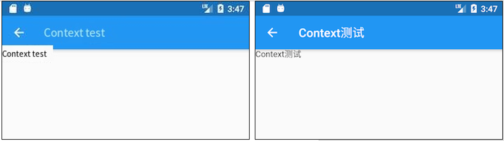
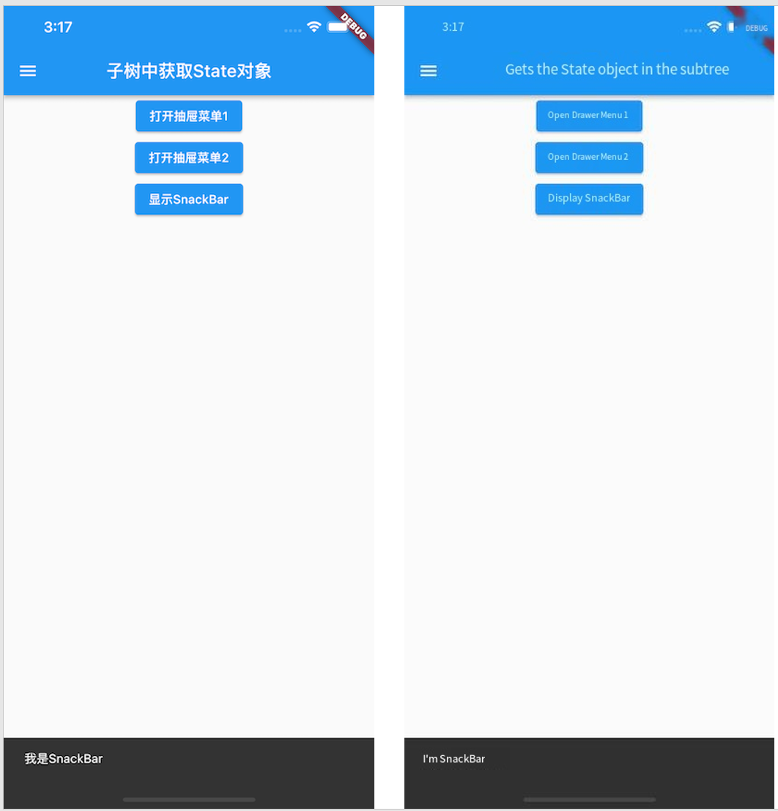

# 2.2 Introduction to Widgets

## 2.2.1 Concept of Widget

In the previous introduction, we know that almost all objects in Flutter are widgets. Unlike Views or ViewControllers in native development, widgets in Flutter have a broader concept and can represent not only UI elements but also functional components such as: `GestureDetector ` for gesture detection, `Theme` for APP theme data passing, and so on, while Views or ViewControllers in native development usually just refer to UI elements. Later, we may use the terms "views" and "components" when describing UI elements, but the reader needs to know that they are widgets, just different expressions in different scenarios. Since Flutter is primarily about building a user interface, for the most part, the reader can think of a widget as a view component rather than making unnecessary distinctions in their concepts.

The UI is built and practiced in the way widgets nested within widgets in Flutter, so remember that everything in Flutter is a Widget.

## 2.2.2 Widget Interface

In Flutter, the function of a widget is to "describe the configuration of a UI element." That is, the Widget does not represent the display element that will eventually be drawn on the device screen. The configuration information is the parameters that the Widget receives. The content of the text, the alignment, and the text style are all its configuration information. Let's take a look at the Widget class declaration:

```dart
@immutable // Immutable
abstract class Widget extends DiagnosticableTree {
  const Widget({ this.key });

  final Key? key;

  @protected
  @factory
  Element createElement(a);@override
  String toStringShort() {
    final String type = objectRuntimeType(this, 'Widget');
    return key = = null ? type : '$type- $key';
  }

  @override
  void debugFillProperties(DiagnosticPropertiesBuilder properties) {
    super.debugFillProperties(properties);
    properties.defaultDiagnosticsTreeStyle = DiagnosticsTreeStyle.dense;
  }

  @override
  @nonVirtual
  bool operator = =(Object other) = > super = = other;

  @override
  @nonVirtual
  int get hashCode = > super.hashCode;

  static bool canUpdate(Widget oldWidget, Widget newWidget) {
    return oldWidget.runtimeType = = newWidget.runtimeType
        && oldWidget.key = =newWidget.key; 
  }
  //... 
}
```

- `@immutable` means that the Widget is immutable, which limits the properties defined in the Widget (i.e. configuration information) to be final. Why not allow the properties defined in the Widget to change? This is because the Widget tree is rebuilt in Flutter if the properties change, that is, a new Widget instance is created to replace the old Widget instance, so allowing Widget properties to change is meaningless because the Widget itself will be replaced once its properties change. This is why the properties defined in the Widget must be final.
- `Widget `Class inherited from `DiagnosticableTree`,  `DiagnosticableTree` is the diagnostic tree providing debugging information.
- `Key`: A [Key](https://api.flutter.dev/flutter/foundation/Key-class.html) is an identifier for [Widget](https://api.flutter.dev/flutter/widgets/Widget-class.html)s, [Element](https://api.flutter.dev/flutter/widgets/Element-class.html)s and [SemanticsNode](https://api.flutter.dev/flutter/semantics/SemanticsNode-class.html)s. It's used in the `canUpdate()` method to decide whether to resue the old element or create a new element in the next build time,.
- `createElement()`: As mentioned earlier, "One widget can correspond to many `Element`";  When the Flutter framework constructs the UI tree, it first calls this method to generate corresponding nodes' `Element` objects. This method is invoked implicitly by the Flutter framework and is rarely invoked during our development.
- `debugFillProperties(...)` overwrites its parent class to set some features of the diagnostic tree.
- `canUpdate(...)` is a static method that is mainly used in reusing old elements when the widget tree rebuilds. As we can see from its source code, as long as `new Widget ` and `old Widget ` have the same `runtimeType` and `key`, the `new widget ` will be used to update the configuration of the corresponding  `Element` object, or a new `Element` object will be created to replace the old one.

The details of Key and widget reuse will be discussed in more detail later in the book. For now, just know that explicitly adding a key to a widget may (but not necessarily) make the UI more efficient when rebuilt. You can ignore this parameter for now, as will be explained later in the book.

In addition, the Widget class itself is an abstract class, the core of which is the definition of the createElement() interface. In the development of Flutter, we do not directly subclass the Widget class to implement a new widget instance. We usually do this indirectly by subclass StatelessWidget or StatefulWidget class. StatelessWidget and StatefulWidget are directly derived from the Widget class, and these are important abstract classes in Flutter that introduce two types of widget models. We will focus on these two classes next.

## 2.2.3 Four Trees in Flutter

Since widgets only describe the configuration of a UI element, who does the actual layout and drawing? The processes of it is as follows:

1. An Element tree is generated from the Widget tree, and the nodes in the Element tree inherit from the `Element ` class.
2. Generate a Render tree from the Element tree, and the nodes in the render tree inherit from the ` RenderObject `Class.
3. The Layer tree is generated from the render tree and then displayed on the screen. The nodes in the Layer tree inherit from the `Layer` Class.

The actual layout and rendering logic is in the Render tree, where the Element is the glue that binds the widgets and RenderObjects together and can be understood as an intermediate proxy. To illustrate, consider the following Widget tree:

```dart
Container( // A container widget
  color: Colors.blue, // Sets the container background color
  child: Row( // You can arrange child widgets horizontally
    children: [
      Image.network('https://www.example.com/1.png'), // widget that displays pictures
      const Text('A'),],),);
```

Note that if the background color is set in the Container, a new ColoredBox is created inside the Container to fill the background with the following logic:

```dart
if (color ! = null)
  current = ColoredBox(color: color!, child: current);
```

Inside Image, images are rendered by RawImage, while inside Text, text is rendered by RichText. Therefore, the final structure of Widget tree, Element tree and render tree is shown in Figure 2-2:


Here's something to note:

1. There is a one-to-one mapping between Widget and Element, but not between RenderObject and RenderObject. For example `StatelessWidget` and `StatefulWidget` has no corresponding RenderObject.
2. The render tree generates a Layer tree before goes up to the screen, which we'll cover later in the principle section. The reader only needs to remember these three trees for the previous section.

## 2.2.4 StatelessWidget

### 1. Introduction

In the previous section, we introduced StatelessWidget briefly. StatelessWidget is a relatively simple widget that inherits from the Widget class and overrides the createElement() method:

```dart
@override
StatelessElement createElement(a)= > StatelessElement(this);
```

StatelessElement inherits indirectly from the Element class and corresponds to the StatelessWidget (as its configuration data).

The StatelessWidget is used in scenarios where there is no need to maintain state, and it typically builds the UI by nesting other widgets in the build method, recursively building its nested widgets during the build process. Let's look at a simple example:

```dart
class Echo extends StatelessWidget  {
  const Echo({
    Key? key,  
    required this.text,
    this.backgroundColor = Colors.grey, // The default value is grey
  }):super(key:key);
    
  final String text;
  final Color backgroundColor;

  @override
  Widget build(BuildContext context) {
    return Center(
      child: Container(
        color: backgroundColor,
        child: Text(text), ), ); }}
```

The above code implements an Echo widget showing inputted text with specified background color. `echo` is a built-in Linux command that is used to display the text passed in as an argument.

> By convention, widget constructor arguments should use named parameters, and the required parameters in the named parameters should be passed with the required keyword, so that static code analyzers can check them. When inheriting a widget, the first parameter should usually be `Key`. In addition, if a widget needs to receive child widget(s), then the child or children parameter should usually be placed last in the parameter list. Also by convention, widget properties should be declared final as much as possible to prevent accidental changes.

We can then use it in the following ways:

```dart
 Widget build(BuildContext context) {
  return Echo(text: "hello world");
}
```

Figure 2-3 shows the effect after operation:


### 2. Context

The build method takes a context argument, which is an instance of the BuildContext class that represents the context of the current widget in the widget tree, Each widget corresponds to a context object (because each widget is a node in the widget tree). In fact, the context is a handle for the current widget to perform "related operations" at its location in the widget tree, such as providing a way to traverse up the widget tree from the current widget and to find the parent widget by widget type. Here is an example of getting a parent widget in a subtree:

```dart
class ContextRoute extends StatelessWidget  {
  @override
  Widget build(BuildContext context) {
    return Scaffold(
      appBar: AppBar(
        title: Text("Context test"),
      ),
      body: Container(
        child: Builder(builder: (context) {
          // Traverse up the widget tree to find the nearest parent widget at the type of Scaffold
          Scaffold scaffold = context.findAncestorWidgetOfExactType<Scaffold> ();// Return AppBar's title, which is actually Text("Context test ").
          return (scaffold.appBar as AppBar).title; }),),); }}
```

Figure 2-4 shows the effect after operation:



> Note: We will use some of the Context methods as the book goes on, so that the reader can get a sense of it in a specific scenario. We'll cover more about BuildContext later in the advanced section as well.

## 2.2.5 StatefulWidget

Like `StatelessWidget`, `StatefulWidget` inherits from the `Widget` class and overwrites the  `createElement()  `method, except that it returns a different `Element` object. In addition, a new interface has been added to the `StatefulWidget` class, `createState()`.

Let's look at the class definition for StatefulWidget:

```dart
abstract class StatefulWidget extends Widget {
  const StatefulWidget({ Key key }) : super(key: key);
    
  @override
  StatefulElement createElement(a)= > StatefulElement(this);
    
  @protected
  State createState(a); 
}
```

- StatefulElement inherits indirectly from the Element class and corresponds to StatefulWidget (as its configuration data). StatefulElement may call `createState()` several times to create a State object.

- `createState()` is used to create state associated with the StatefulWidget, which may be called several times during the StatefulWidget's life cycle. For example, when a StatefulWidget is inserted into multiple locations in the widget tree at the same time, the Flutter framework calls this method to generate a separate State instance for each location, essentially one StatefulElement corresponds to one State instance.

    > In the StatefulWidget, there is a one-to-one relationship between the State object and the StatefulElement, so in the Flutter SDK documentation you often see statements like "remove the State object from the tree" or "insert the State object into the tree". The tree in this case refers to the Element tree generated from the widget tree. The Flutter SDK documents often refer to the word "tree" and we can tell which tree is being referred to depending on the context. In fact, the ultimate goal of any tree is to describe the structure of the UI and to draw information, so when the idea of a tree is encountered in Flutter, unless otherwise stated, it can be understood as "a tree of nodes that constitutes a user interface", and the reader does not have to be torn between these concepts.

## 2.2.6 State

### 1. Introduction

A StatefulWidget class corresponds to a `State` class. `State` represents the state maintained by the StatefulWidget. The state information stored in `State` can be:

1. It can be read synchronously when the widget is built.
2. It can be changed during the widget lifecycle. And we can call `setState() ` method manually when the State is changed to notifies the Flutter framework of the change, then the Flutter framework will call the `build` method again after receiving the message to rebuilds the widget tree to update the UI.

There are two common attributes in State:

1. `widget`, which represents the widget instance associated with the State instance, set dynamically by the Flutter framework. Note that this association is not permanent, because during the application lifecycle, the widget instance at a node in the UI tree may change when rebuilt, but the State instance is only created when first inserted into the tree. When rebuilt, if the widget has been modified, The Flutter framework dynamically sets State.widget as a new widget instance.
2. `context`, which is the BuildContext corresponding to StatefulWidget and is equivalent to the BuildContext of StatelessWidget.

### 2. State life cycle

Understanding the life cycle of State is important to the development of flutter. In order to impress the reader, we demonstrate the life cycle of State through an example in this section. In the following example, again using the counter function as an example, we implement a CounterWidget component that we click to increment the counter by 1. Since we want to save the counter's numerical state, we should inherit the StatefulWidget as follows:

```dart
class CounterWidget extends StatefulWidget {
  const CounterWidget({Key? key, this.initValue = 0});

  final int initValue;

  @override
  _CounterWidgetState createState(a)= > _CounterWidgetState(a); 
}
```

CounterWidget receives an initValue integer argument, which represents the initial value of the counter. Let's look at the code for State:

```dart
class _CounterWidgetState extends State<CounterWidget> {
  int _counter = 0;

  @override
  void initState() {
    super.initState(a);// Initialize the state
    _counter = widget.initValue;
    print("initState");
  }

  @override
  Widget build(BuildContext context) {
    print("build");
    return Scaffold(
      body: Center(
        child: TextButton(
          child: Text('$_counter'),
          // The counter increases after clicking
          onPressed:(a)= > setState(()= > ++_counter,
          ),
        ),
      ),
    );
  }

  @override
  void didUpdateWidget(CounterWidget oldWidget) {
    super.didUpdateWidget(oldWidget);
    print("didUpdateWidget ");
  }

  @override
  void deactivate() {
    super.deactivate(a);print("deactivate");
  }

  @override
  void dispose() {
    super.dispose(a);print("dispose");
  }

  @override
  void reassemble() {
    super.reassemble(a);print("reassemble");
  }

  @override
  void didChangeDependencies() {
    super.didChangeDependencies(a);print("didChangeDependencies"); }}
```

Next, we create a new route in which we display only one CounterWidget:

```dart
class StateLifecycleTest extends StatelessWidget {
  const StateLifecycleTest({Key? key}) : super(key: key);

  @override
  Widget build(BuildContext context) {
    return CounterWidget();
  }
}
```

We run the application and open the routing page. When the new routing page opens, a number 0 appears in the center of the screen, and the console log outputs:

```dart
I/flutter ( 5436): initState
I/flutter ( 5436): didChangeDependencies
I/flutter ( 5436): build
```

As you can see, the `initState` method is first called when the StatefulWidget is inserted into the widget tree.

Then we click ⚡️ button to hot reload, the console output log is as follows:

```dart
I/flutter ( 5436): reassemble
I/flutter ( 5436): didUpdateWidget 
I/flutter ( 5436): build
```

You can see that neither `initState` nor `didChangeDependencies` is called, while `didUpdateWidget` is called.

Next, we remove CounterWidget from the widget tree and change the StateLifecycleTest build method to:

```dart
 Widget build(BuildContext context) {
  // Remove the counter
  //return CounterWidget ();
  // Return any Text()
  return Text("xxx");
}
```

Then hot reload, log as follows:

```dart
I/flutter ( 5436): reassemble
I/flutter ( 5436): deactive
I/flutter ( 5436): dispose
```

As you can see, when CounterWidget is removed from the widget tree, deactive and dispose are called in turn.

Here's a look at the individual callback functions:

- initState: The callback is called when the widget is first inserted into the widget tree. The Flutter framework calls this callback only once for each State object, so it usually does some one-time operations within the callback, such as state initialization and subscribing to event notifications from the subtree. Cannot call `BuildContext.DependOnInheritedWidgetOfExactType` in this callback (the method is used to get an above InheritedWidget closest to the current widget when traversing up the widget tree, we will describe the `InheritedWidgets` in a later section). The reason is that the `InheritFromWidgets` in the widget tree may also change after initialization. So the correct way is to call it in the `build()` method or `didChangeDependencies()`.
- didChangeDependencies() : called when the dependencies of the State object change; For example: `InheritedWidget` was included in `build()` method (Chapter 7 dives into `InheritedWidget`), and it changed in subsequent `build()` callbacks, then all children of the `InheritedWidget` 's `didChangeDependencies()` methods are called. A typical scenario is that the Flutter framework notifies widgets to call this callback when the system language Locale or application theme changes. Note that the corresponding `didChangeDependencies` method is also called when the widget is created and mounted at the first time (including recreations).
- build() : This callback, which readers should be familiar with by now, is primarily used to build widget subtrees and is called in the following scenarios:
    1. After the `initState()`call.
    2. After the `didUpdateWidget()call.
    3. After the `setState()call.
    4. After the `didChangeDependencies()`call.
    5. The State object is removed from one position in the tree (deactivate is called), then it is reinserted to another position in the tree, then the `build()` is called.
- reassemble() : This callback is provided specifically for development debugging and is called on hot reload, which is never called in Release mode.
- didUpdateWidget() : When the widget is rebuilt, the Flutter framework calls widget.canupdate() to detect the old and new nodes at the same location in the widget tree and then determine if an update is needed, this callback is called if `widget.canupdate()` returns true. As mentioned earlier, `widget.canUpdate()` returns true if the key and runtimeType of the new and old widgets are equal seperately, That is, didUpdateWidget() is called when the key and runtimeType of the new and old widgets are equal seperately.
- deactivate() : This callback is called when the State object is removed from the tree. In some scenarios, the Flutter framework inserts the State object back into the tree, such as when the subtree containing the State object is moved from one location in the tree to another location (this can be done through `GlobalKey`). The `dispose()` method is then called if it is not reinserted into the tree.
- dispose() : called when a State object is permanently removed from the tree; Resources are typically released in this callback.

Figure 2-5 shows the life cycle of StatefulWidget.


> Note: When you overwrite methods from StatefulWidget, you call the parent method in the subclass method for any parent method that contains the `@mustCallSuper` annotation.

## 2.2.7 Obtaining the State object from the widget tree

Because the logic of the StatefulWidget is in its State, many times we need to get the State object of the StatefulWidget to call methods. For example, the ScaffoldState class corresponding to the Scaffold component defines a method for opening SnackBar (the hint bar at the bottom of the routing page). There are two ways to get the State object of the parent StatefulWidget in the tree of child widgets.

### 1. Obtain the value from Context

The context object with a findAncestorStateOfType () method, this method can upward from the current node along the widget tree search specified type StatefulWidget corresponding State object. Here is an example of how to open SnackBar:

```dart
class GetStateObjectRoute extends StatefulWidget {
  const GetStateObjectRoute({Key? key}) : super(key: key);

  @override
  State<GetStateObjectRoute> createState(a)= > _GetStateObjectRouteState(a); }class _GetStateObjectRouteState extends State<GetStateObjectRoute> {
  @override
  Widget build(BuildContext context) {
    return Scaffold(
      appBar: AppBar(
        title: Text("Get State object in subtree"),
      ),
      body: Center(
        child: Column(
          children: [
            Builder(builder: (context) {
              return ElevatedButton(
                onPressed: () {
                  // Finds the ScaffoldState object corresponding to the most recent Scaffold of the parent
                  ScaffoldState _state = context.findAncestorStateOfType<ScaffoldState> ()!;
                  // Open the drawer menu
                  _state.openDrawer(a); }, child: Text('Open Drawer Menu 1'),); }), ], ), ), drawer: Drawer(),); }}
```

In general, if the State of a StatefulWidget is private (and should not be exposed to the outside world), then our code should not get its state object directly. If the State of the StatefulWidget is what you want to expose (and usually some component action), you can get its state object directly. But by the context. FindAncestorStateOfType StatefulWidget state method is universal, we can't state whether private StatefulWidget specified in the grammatical level, Therefore, there is a default convention in the development of Flutter: if the State of the StatefulWidget is intended to be exposed, a static method of StatefulWidget should be provided to obtain its state object, which can be obtained directly by the developer. If the State does not want to be exposed, the of method is not provided. This convention is everywhere in the Flutter SDK. So, the Scaffold in the example above also provides an of method that we can actually call directly:

```dart
Builder(builder: (context) {
  return ElevatedButton(
    onPressed: () {
      // ScaffoldState is obtained directly through the of static method
      ScaffoldState _state=Scaffold.of(context);
      // Open the drawer menu
      _state.openDrawer(a); }, child: Text('Open Drawer Menu 2'),); }),
```

For example, if we want to display the snack bar, we can do the following:

```dart
Builder(builder: (context) {
  return ElevatedButton(
    onPressed: () {
      ScaffoldMessenger.of(context).showSnackBar(
        SnackBar(content: Text("I'm SnackBar.")),); }, child: Text('Show SnackBar'),); }),
```

After running the above example, click "Show SnackBar", and the effect is as shown in Figure 2-6:



### 2. Via GlobalKey

There is also a universal method of obtaining State objects for Flutter -- via GlobalKey! There are two steps:

1. Add GlobalKey to the target StatefulWidget.

    ```dart
    // Define a GlobalKey. Since GlobalKeys are globally unique, we use static variable storage
    static GlobalKey<ScaffoldState> _globalKey= GlobalKey(a); ...Scaffold(
        key: _globalKey , // Set the key...)
    ```

2. Get the State object via GlobalKey

    ```dart
    _globalKey.currentState.openDrawer(a)
    ```

GlobalKey is a mechanism provided by Flutter to reference elements throughout the App. If a widget is set to GlobalKey, we can get the widget object via globalKey.currentWidget, globalkey. currentElement to get the element object corresponding to the widget, If the current widget is a StatefulWidget, you can use globalKey.currentState to get the state object for the widget.

> Note: Using GlobalKey is expensive and should be avoided if there are other alternatives. In addition, the same GlobalKey must be unique in the entire widget tree and cannot be repeated.

## 2.2.8 Using the RenderObject to customize Widgets

Both StatelessWidget and StatefulWidget are used to compose other components. They do not have a corresponding RenderObject. Many of the basic components in the Flutter library are not implemented through StatelessWidget and StatefulWidget, such as Text, Column, Align, etc., which are like building blocks, StatelessWidget and StatefulWidget can build blocks in different ways, but only if there are blocks, which are implemented using a custom RenderObject. In fact, the original way that Flutter defines components is by defining a RenderObject, with StatelessWidget and StatefulWidget as just two helper classes. Here's a quick demonstration of how to define a component using a RenderObject:

```dart
class CustomWidget extends LeafRenderObjectWidget{
  @override
  RenderObject createRenderObject(BuildContext context) {
    // Create a RenderObject
    return RenderCustomObject(a); }@override
  void updateRenderObject(BuildContext context, RenderCustomObject  renderObject) {
    // Update the RenderObject
    super.updateRenderObject(context, renderObject); }}class RenderCustomObject extends RenderBox{

  @override
  void performLayout() {
    // Implement the layout logic
  }

  @override
  void paint(PaintingContext context, Offset offset) {
    // Implement drawing}}
```

If the component does not contain child components, then we can directly inherit from LeafRenderObjectWidget, which is a subclass of RenderObjectWidget, and RenderObjectWidget inherits from widgets. Let's look at its implementation:

```dart
abstract class LeafRenderObjectWidget extends RenderObjectWidget {
  const LeafRenderObjectWidget({ Key? key }) : super(key: key);

  @override
  LeafRenderObjectElement createElement(a)= > LeafRenderObjectElement(this);
}
```

The widget implements the createElement method, which creates an Element object of type LeafRenderObjectElement for the component. If the custom widget can contain child components, you can choose according to the number of child components to inherit SingleChildRenderObjectWidget or MultiChildRenderObjectWidget, They also implement the createElement() method, which returns a different type of Element object.

We then override the createRenderObject method, which is defined in RenderObjectWidget and is called by the component's corresponding Element (when building the render tree) to generate the render object. Our main task is to implement the render object class returned by createRenderObject, in this case RenderCustomObject. The updateRenderObject method is a callback used to update the component render object if the component tree state changes but the RenderObject does not need to be recreated.

RenderCustomObject class inherits from RenderBox, and RenderBox inherits from RenderObject. We need to implement layout, rendering, event response and other logic in RenderCustomObject. The knowledge will be covered throughout the book, but don't worry, we will introduce it in later chapters.

## 2.2.9 Introduction to the Flutter SDK built-in component library

Flutter provides a rich and powerful base component library on top of which Flutter provides a Material style (the default visual style for Android) and a Cupertino style (the visual style for iOS) component library. To use the base component library, you need to lead in:

```dart
import 'package:flutter/widgets.dart';
```

Let's take a look at the common components.

### 1. Basic components

- Text: This component lets you create a formatted text.
- Row, Column: These layout class widgets with elastic Spaces allow you to create flexible layouts in both horizontal (Row) and vertical (Column) directions. The design is based on the Flexbox layout model for Web development.
- `Stack`: Instead of linear layout (and Android)`FrameLayout`Similar), [`Stack`](https://docs.flutter.dev/flutter/widgets/stack-class.html) allows sub-widgets to Stack, which you can use `Positioned`To locate them relative to`Stack`The position of the top, bottom, left and right sides. Stacks is designed based on the absolute positioning layout model used in Web development.
- Container: Container lets you create rectangular visual elements. A Container can decorate a BoxDecoration, such as a background, a border, ora shadow. A Container can also have margins, padding, and constraints that apply to its size. In addition, Container can transform it in three dimensions using a matrix.

### 2. Material component

Flutter offers a rich set of Material components that help us build applications that adhere to the Material Design design specifications. The Material application starts with the MaterialApp component, which creates the necessary components at the root of the application, such as the Theme component, which is used to configure the theme of the application. Whether or not to use the MaterialApp is entirely optional, but it is a good practice to use it. In the previous example, we have used several Material components such as: Scaffold, AppBar, TextButton, and so on. To use the Material component, you need to introduce it:

```
import 'package:flutter/material.dart';
```

### 3. Cupertino components

The Flutter also offers a rich set of Cupertino-style components, although not yet as rich as the Material component, but it is still being refined. It is worth noting that there are some Material components in the Material library that can switch presentation styles based on the actual running platform, such as MaterialPageRoute, which uses Android's default page switching animation (bottom up) when switching routes. On iOS, it uses iOS's default page-switching animation (from right to left). Since we didn't have an example of the Cupertino component in the previous example, let's implement a simple Cupertino component style page:

```dart
Import the cupertino widget library
import 'package:flutter/cupertino.dart';

class CupertinoTestRoute extends StatelessWidget  {
  @override
  widget build(BuildContext context) {
    return CupertinoPageScaffold(
      navigationBar: CupertinoNavigationBar(
        middle: Text("Cupertino Demo"),
      ),
      child: Center(
        child: CupertinoButton(
            color: CupertinoColors.activeBlue,
            child: Text("Press"),
            onPressed:() {}),); }}
```

Below (Figure 2-7) is a screenshot of what the page looks like on iPhoneX:

[

There are two types of widgets with Flutter: StatefulWidget and StatelessWidget. It is important to understand the difference between them. Widgets will be the cornerstone of building Flutter.

Flutter provides a wealth of components that can be used as needed in actual development without worrying about making your application's installation package bigger by introducing too many component libraries. This is not web development. dart will only compile the code you use at compile time. Since both Material and Cupertino are on top of the base component library, if we introduce either of those in our application, we don't need to introduce flutter/ widgets.dart because they've already been introduced internally.

As an aside, the examples later in this chapter will use some layout class components, such as Scaffold, Row, Column, and so on, which will be covered in detail in the Layout Class Components chapter.


____

Du Wen works for the original Flutter in Practice 2nd Edition in Chinese Language. You can find the original Github project [flutter_in_action_2nd](https://github.com/flutterchina/flutter_in_action_2nd) there, and the translated English version in my Github project [Flutter_In_Practice_V2_English](https://github.com/happylee1/Flutter_In_Practice_V2_English) here. I find this book is really useful and try to translate and tweak the book content to benefit more Flutter developers like me.